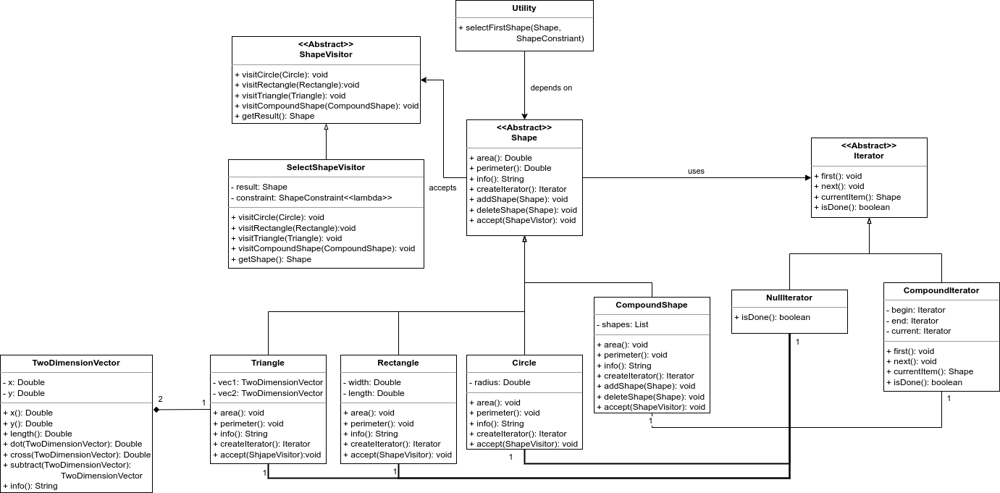

# Midterm Practice
This is a exercise for posd2021f midterm.
You can follow the [Design Blueprint](#design_blueprint) to construct it.

> Latest Update: 2021-11-07

## Combination
* This exercise consists of **composition**, **iterator**, **factory method** and **visitor pattern**.
* The requirements follow the [Assignment 1](docs/Assignment1.md) and [Assignment 3](docs/Assignment3.md).
* If you would like to practice **visitor pattern**, just follows the same requirement of **iterator pattern**. Replace **iterator pattern** with **visitor pattern**.

## Design Blueprint
* The Class Diagram:

## Reference
* [Cplusplus](https://www.cplusplus.com/)
* [Makefile Tutorial](https://makefiletutorial.com/#top)
* [POSD2021f Course](https://ssl-gitlab.csie.ntut.edu.tw/yccheng/posd2021f)
* [Design Pattern Info](http://aleteya.cs.buap.mx/~jlavalle/papers/patrones%20de%20diseno/design%20paterns/hires/patcafso.htm)

## Conclusion
* Hao-Ying Cheng (MaskerTim)
    * Affliation: National Taipei University of Technology
    * Email: t109598001@org.ntut.tw